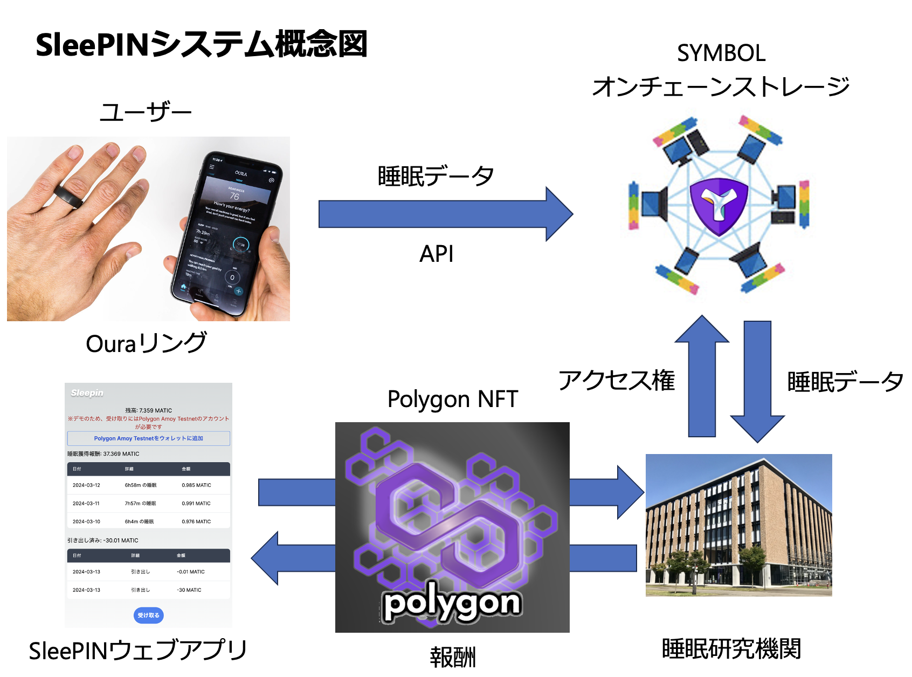
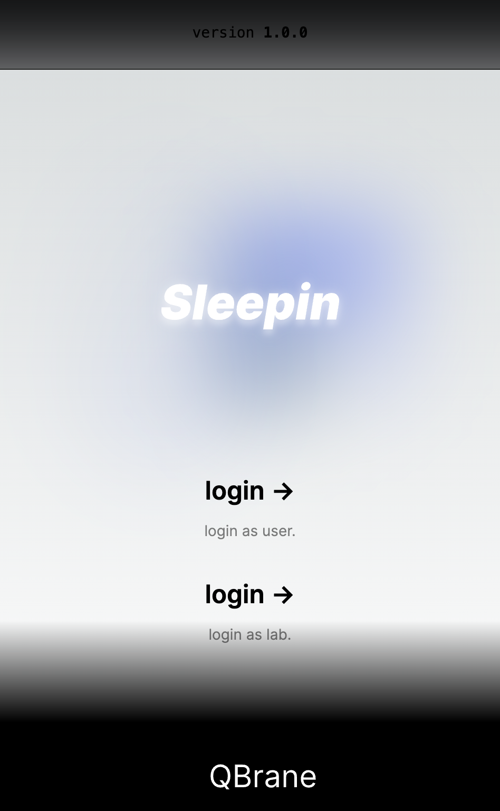
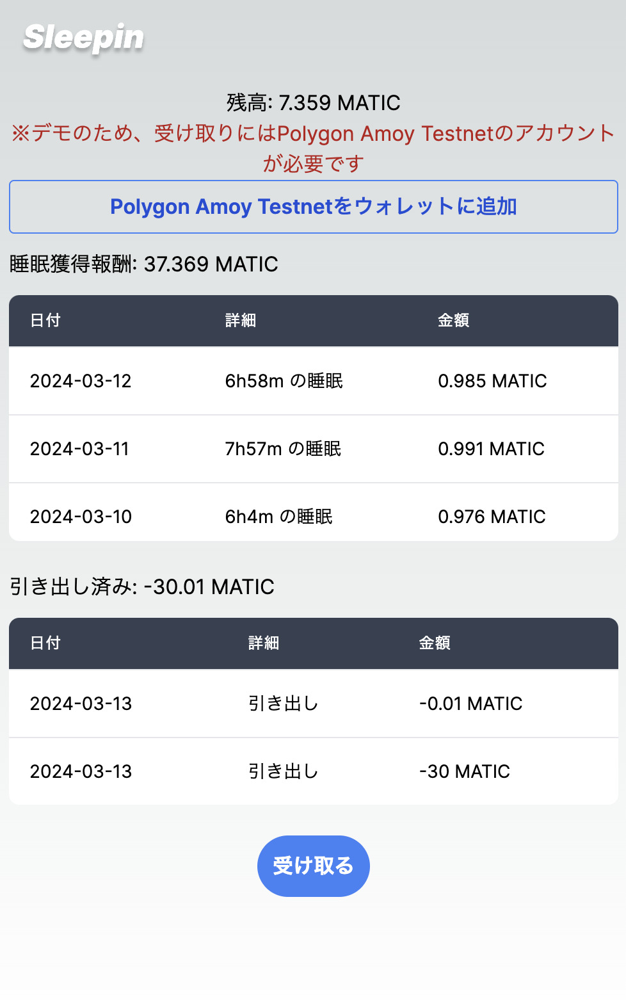
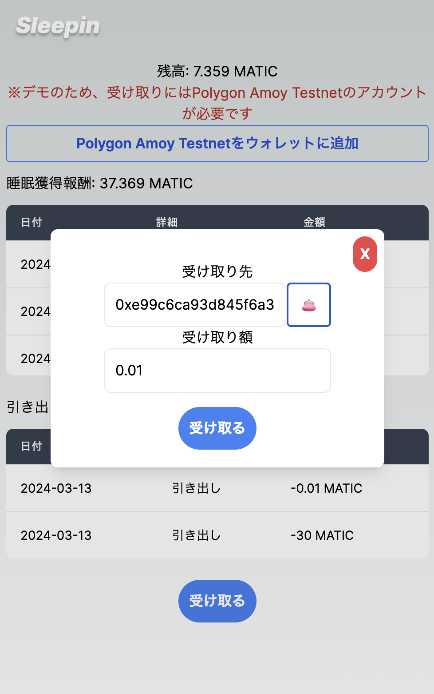
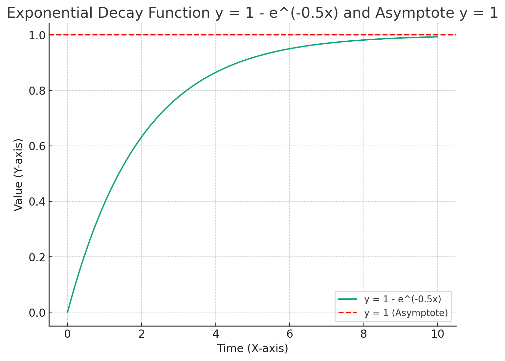

# README

# SleePIN

Githubレポジトリ：[https://github.com/haruom/qbrane-web](https://github.com/haruom/qbrane-web)

デモアプリ：[https://duckling-electric-snake.ngrok-free.app/status](https://duckling-electric-snake.ngrok-free.app/status)

## 開発の背景

日本人の平均睡眠時間は、世界OECDによる2021年版の調査によると33カ国の中で最も短く、日本人の睡眠不足が大きな社会問題になっている。睡眠不足による日本の経済損失は、年間約15兆円に及ぶと言われており、プレゼンティーイズムと呼ばれる「健康の問題を抱えつつも仕事を行っている状態」が日本で慢性化している。私達はこの社会問題を解決するため、日本人の睡眠時間を少しでも延ばし、健康増進やパフォーマンス向上することを目的として、長くて質の良い睡眠を取ると仮想通貨を報酬として得られる「SleePIN」とよばれるハイブリッドフルオンチェーンシステムを開発した。

## SleePINの概要

SleePINは睡眠を正確に計測できる「Ouraリング」と呼ばれるウェアラブルデバイスを身に付けて睡眠データを取得し、その睡眠データを睡眠研究機関に提供することで、ユーザーは報酬として仮想通貨（Polygon）を獲得できるアプリケーションである。睡眠研究期間は、その睡眠データを活用した研究を行い、睡眠の個人最適化システムなどのAI開発を行うことで、ユーザーへ対する健康利益を提供することができるようになる。

### ウェブアプリデモ

睡眠データによる報酬獲得

獲得トークンの引き出し

### 睡眠データの保存

睡眠データは、OuraのAPIを経由して取得され、シンボルのテストネット上に暗号化して格納される。アクセス権を持っている睡眠機関がチェーン上の睡眠データを取得することが可能である。以下は睡眠データが保存されているシンボルチェーンのURLの例である。

[http://20.48.92.124:3000/transactions/confirmed/B8CE55B531964ACB8A4BA27EB61668E2F741ED460307BD630BFFAE85F29C597D](http://20.48.92.124:3000/transactions/confirmed/B8CE55B531964ACB8A4BA27EB61668E2F741ED460307BD630BFFAE85F29C597D)

※実運用時は、プラベートなシンボルチェーンに保存する。

### データへのアクセス権NFT

ユーザーは自分の睡眠データへアクセスできるNFTを提供することでその対価を報酬として受け取ることができる。この時、ユーザーはデータを睡眠機関へ共有することに同意したとみなすこととする（アカウント作成時の利用規約やプライバシーポリシーで規定する）。NFTを持っている睡眠機関のみが、睡眠データが保存されているURLへアクセス可能となり、データを取得して分析に使用することができる。

### 報酬計算に用いた計算式

Ouraリングを装着して睡眠するだけで、睡眠時間に応じたトークンを獲得することができる。報酬に用いられる計算式は以下の通りである。

睡眠データの報酬(MATIC)は下記の合計 (1+2) とする

1. 睡眠データ素点：0.5 (MATIC)
2. 睡眠時間ボーナスの計算式：y=0.5*(1−e ^−0.5x) (MATIC)

